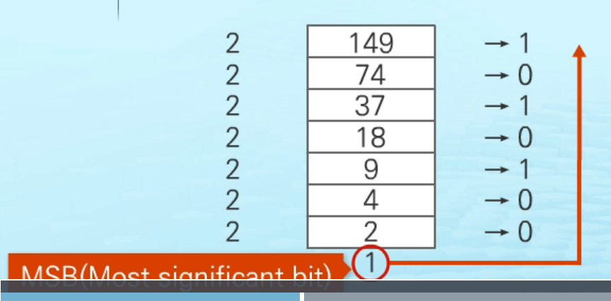
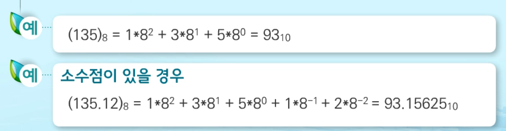
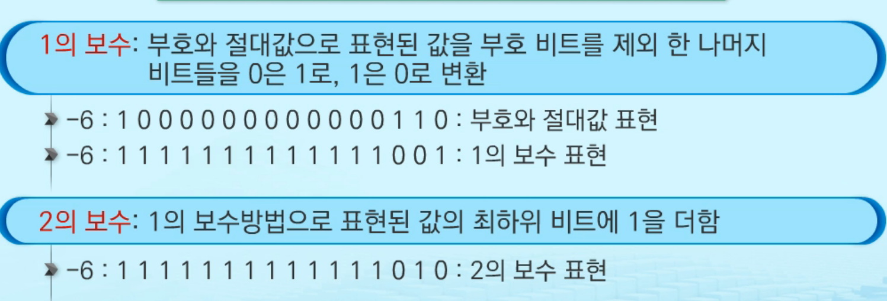

# 1. SW 문제해결

# 2. 알고리즘

* 유한한 단계를 통해 문제를 해결하기 위한 절차나 방법
* 주로 컴퓨터 용어로 쓰이며, 컴퓨터가 어떤 일을 수행하기 위한 단계적 방법

## 1. 알고리즘 복잡도

* 알고리즘 효율
  * 같은 문제에 대한 다른 알고리즘들이 구현되어 컴퓨터에 실행되는 경유
  * 1. 공간적 효율성 : 얼마나 많은 메모리 공간을 요하는가
    2. 시간적 효율성 : 얼마나 많은 시간을 요하는가
  * 효율성은 복잡도로(complexity) 표현 가능 > 복잡도가 높을수록 효율성 저하
  * 시간적 복잡도 분석
    * 하으뒈어 환견, 소프트웨어 환경 등의 영향을 받음
    * 입력크기에 대한 함수로 표기 ( 점근적 표기 사용 )
    * 1. 점근적 상한 `O(BIg-Oh) -표기` :
         * O-표기는 복잡도의 점근적 상한을 나타냄
         * 다항식의 최고차항만 상한에 비례
      2. 점근적 하한 `Ω(Big-Omega)-표기`:
         * 복잡도의 점근적 하한을 의미
         * 다항식의 최고차항(상수는 1로)만큼 최소한의 시간이 걸린다는 의미
      3. 점근적 상-하한이 동일`θ(Theta)-표기`:
         * 최고차항의 값이 같을때 동일한 증가율을 보인다
  * 왜 효율적인 알고리즘이 필요한가?
    * 알고리즘을 사용한 정렬이면 컴퓨터의 사양과 무관하게 시간복잡도를 최소로 가질 수 있다.
    * 효율적인 알고리즘 개발이 더 경제적

# 3. 비트연산

* 프로그래밍 언어에서 비트연산을 사용하는 이유
  * 연산속도를 향상시키거나 메모리 절약 가능

* 엔디안 :
  * 컴퓨터의 메모리와 같은 1차원 공간에 여러개의 연속된 대상을 배열하는 방법을 의미
  * 바이트단위와 워드단위에 주의하지 않으면 오류를 발생 시킬 수 있음
  * 빅 엔디안 :  큰 단위가 앞에나옴(네트워크)
  * 리틀 엔디안 : 작은 단위가 앞에 나옴(대다수 데스크탑)

* XOR 연산 :
  * 비트연산자 ^를 두번 연산하면 처음값을 반환

# 4.진수

## 1. 진법 변환

* 문제해결을 위한 진수변환이 필요한 경우

* 자주 사용되는 진수 - 2진수, 8진수, 10진수, 16진수

* 10진수를 타 진수로 변환하는 방법 :

  * 원하는 타진법의 수로 나눈 뒤 나머지를 거꾸로 읽음

  * 

  * 타 진수를 10진수로 변환하는 방법 :

    * 각 자릿값을 행당 진수의 값을 곱해서 구함
    * 
    * 

  * 음의 정수 표현 방법 : 

    * 1의 보수 : 부호와 절대값으로 표현된 값을 부호 비트를 제외 한 나머지 비드들을 0은 1로, 1은 0으로 변환

    

# 5. 실수

## 컴퓨터에서 실수 표현법

1. 부동 소수점 표기법 사용
   * 소주점의 위치를 고정시켜 표현
2. 단정도 실수(32비트), 배정도 실수(64비트) 