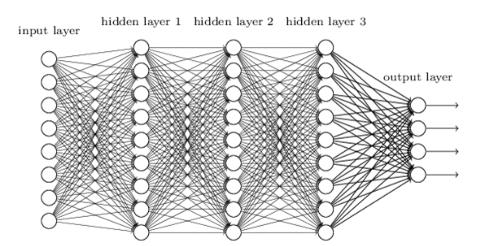

# 마크다운 기초 문법

## 1. 제목(heading)

제목은 `#` 을 통해 작성 가능하다.

제목 레벨은 `H1 ~ H6`까지 존재한다.

### H3

### H3

#### h4

##### h5


## 2. 목록

목록은 `*`을 통해 순서가 없는 목록을 작성할 수 있고, 

`1.`를 통해 순서가 있는 목록을 작성할 수 있다.

* 순서가 없는 목록
* 목록 내용
  * tab을 누르면 다음 레벨로 작성
    * 이것은 또 다음 레벨
    * 엔터 누름
  * 여기 엔터
* 여기 엔터

목록 밖

1. 순서가 있는 목록
2.  두번 째

엔터로 나오기


## 3. 인용

`>` 를 통해서 인용문을 작성할 수 있다.

> 인용문이 작성됩니다.

## 4. 코드 블럭

``` python
# 파이썬에서 주석
print("Hi")
def foo():
    print("Hi")

```

``` javascript
// js 주석
```

## 5. 링크

[구글](http://www.google.com)

[마크다운 가이드](https://guides.github.com/features/mastering-markdown/)

## 6. 이미지




* 파일 > 환경설정 > 이미지에서 `특별한 동작 없음`을 `copy image to custom folder` 로 지정
* check box 3개 체크

## 7. 표

| 1.   | lay  | djdj |
| ---- | ---- | ---- |
| 2.   |      |      |
|      |      |      |
|      |      |      |


## 8. 기타

수직선(---)

*이탤릭체(기울임체)*

**볼드체(굵게)**

~~취소선~~

